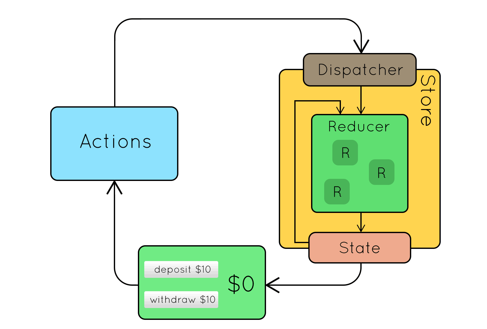

### Pros of Redux
- Circular, unidirectional data flow.
- Immutability, the State is never mutated outside of the dataflow.
- In synchronous situations, Redux guarantees the application will behave in a very predictable manner.    This makes debugging easy.
- The State is contained in something called a Store, and you can keep the previous 5 versions of the State in the app, with a list of actions performed. This can give you a record of events that happened just before a crash, and this is something that can be priceless when debugging!

### Cons of Redux
- A lot of boilerplate.
- A paradigm of having reducers and actions is mind-bending to many people.
- Redux well in synchronous situations but there can be serious side effects when you start doing things asynchronously.
